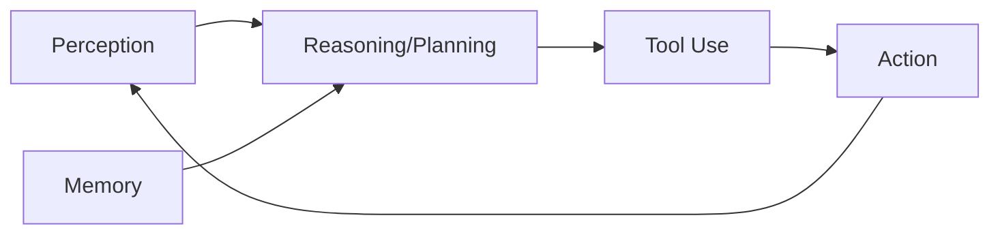

# 🤖 Agentic AI — AI Agent

## Khái niệm

**Agentic AI (AI Agent)** là hệ thống AI có khả năng **tự chủ** thực hiện các tác vụ phức tạp thông qua việc lập kế hoạch, sử dụng công cụ, và tương tác với môi trường.

## Các thành phần

## Loại Agent

| Loại | Mô tả | Ví dụ |
|---|---|---|
| **Simple Reflex** | Phản xạ theo luật | Chatbot cơ bản |
| **Goal-based** | Lập kế hoạch đạt mục tiêu | ReAct Agent |
| **Tool-using** | Sử dụng công cụ bên ngoài | Code Interpreter |
| **Multi-Agent** | Nhiều agent phối hợp | CrewAI, AutoGen |
| **Orchestrator** | Agent điều phối agent khác | Hermes Agent |

## Framework phổ biến

- **LangChain / LangGraph**
- **AutoGen** (Microsoft)
- **CrewAI**
- **Semantic Kernel** (Microsoft)
- **Hermes Agent** (Nous Research)
- **Claude Code / Codex CLI**

## Ứng dụng thực tế

- 📱 Trợ lý ảo doanh nghiệp
- 💻 Lập trình tự động
- 📊 Phân tích dữ liệu
- 🔄 Tự động hóa quy trình
- 🏢 One-Person Company (OPC)
