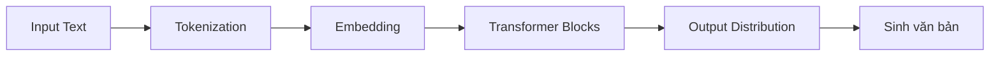

# 🧠 LLM — Large Language Model

## Khái niệm

**LLM (Large Language Model)** là mô hình ngôn ngữ lớn, được huấn luyện trên khối lượng văn bản khổng lồ để hiểu và sinh văn bản giống con người.

## Cách hoạt động

LLM sử dụng kiến trúc **Transformer** với cơ chế **Self-Attention**:

## Các LLM phổ biến

| Mô hình | Nguồn gốc | Tham số |
|---|---|---|
| GPT-4o | OpenAI | ~1.8T |
| Claude 4 | Anthropic | ~1.0T |
| Gemini 2.5 | Google | ~1.5T |
| DeepSeek V3 | DeepSeek (CN) | ~671B MoE |
| Llama 4 | Meta | ~400B |

## Ứng dụng

- Chatbot, trợ lý ảo
- Viết nội dung, code
- Dịch thuật
- Phân tích dữ liệu
- Tổng hợp thông tin

## Tài liệu tham khảo

- [[Attention Is All You Need]] (Vaswani et al., 2017)
