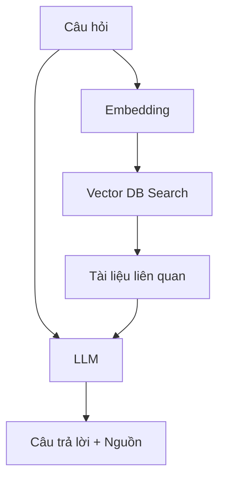

# 🔗 RAG — Retrieval-Augmented Generation

## Khái niệm

**RAG (Retrieval-Augmented Generation)** là kỹ thuật kết hợp truy xuất thông tin (retrieval) với sinh văn bản (generation) để cải thiện độ chính xác của LLM.

## Cách hoạt động

## Quy trình

1. **Indexing:** Chia nhỏ tài liệu → Embedding → Lưu vào Vector DB
2. **Retrieval:** Khi có câu hỏi → Embedding câu hỏi → Tìm kiếm vector tương đồng
3. **Generation:** LLM nhận câu hỏi + tài liệu tìm được → Sinh câu trả lời

## Framework phổ biến

- **LangChain** — Framework Python phổ biến nhất
- **LlamaIndex** — Chuyên data indexing cho LLM
- **Haystack** — deepset.io
- **Chroma, Pinecone, Weaviate** — Vector DB

## Ưu điểm

- ✅ Giảm ảo giác (hallucination)
- ✅ Cập nhật kiến thức không cần fine-tune lại
- ✅ Trích dẫn nguồn rõ ràng
- ✅ Chi phí thấp hơn fine-tuning
