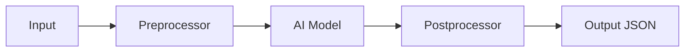

# 🤖 AI OCR — Tổng quan

## Giới thiệu

**AI OCR** là giải pháp nhận dạng ký tự quang học thế hệ mới, sử dụng AI để đọc và trích xuất văn bản từ hình ảnh, PDF, tài liệu scan.

## Tính năng chính

- ✅ Nhận dạng đa ngôn ngữ (VN, EN, CN, JP...)
- ✅ Xử lý PDF, ảnh, tài liệu scan
- ✅ Trích xuất bảng biểu, số liệu
- ✅ Tích hợp API đơn giản
- ✅ Chạy local, không cần GPU

## Kiến trúc

## Công nghệ

- **Backend:** Python / FastAPI
- **Model:** TrOCR, PaddleOCR, DocTR
- **Database:** PostgreSQL + Vector DB
