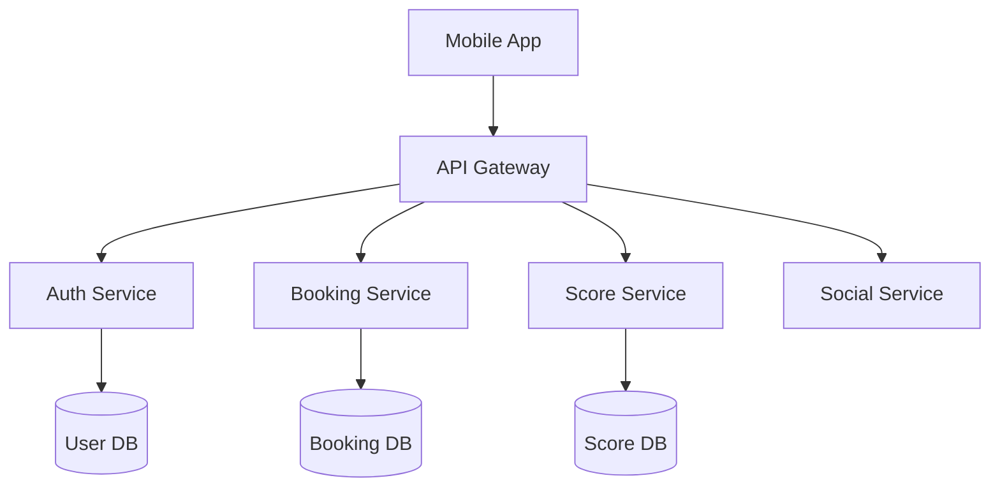

# 🏌️ ALOGOFL — Tổng quan

## Giới thiệu

**ALOGOFL** là nền tảng kết nối cộng đồng golf — đặt sân, theo dõi điểm, kết bạn, thi đấu.

## Tính năng chính

- ✅ Đặt sân golf trực tuyến
- ✅ Theo dõi điểm và handicap
- ✅ Kết nối bạn chơi golf
- ✅ Tổ chức giải đấu
- ✅ Thống kê thành tích

## Kiến trúc

## Công nghệ

- **Frontend:** React Native / Flutter
- **Backend:** Go / Gin
- **Database:** PostgreSQL + Redis
- **Realtime:** WebSocket
