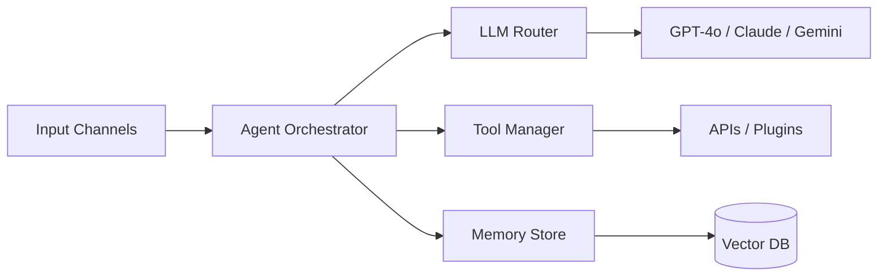

# 🧠 ENMA AI AGENT — Tổng quan

## Giới thiệu

**ENMA AI AGENT** là hệ thống AI Agent đa năng — tự động hóa quy trình nghiệp vụ, phân tích dữ liệu, hỗ trợ ra quyết định thông minh.

## Tính năng chính

- ✅ Tự động hóa quy trình doanh nghiệp
- ✅ Xử lý ngôn ngữ tự nhiên (NLP)
- ✅ Phân tích dữ liệu thời gian thực
- ✅ Tích hợp đa kênh (Telegram, Web, API)
- ✅ Hỗ trợ đa mô hình AI (GPT, Claude, Gemini)

## Kiến trúc

## Công nghệ

- **Core:** Python / Hermes Agent
- **LLM:** OpenAI, Anthropic, Google, DeepSeek
- **Memory:** PostgreSQL pgvector / Redis
- **Platform:** Telegram, Web, MCP
